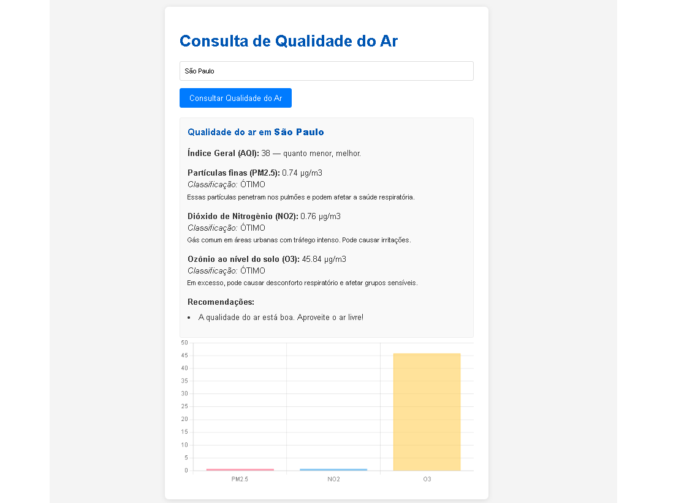

<!-- 
  Tags: Monolíto
  Label: 🌬️ Consulta de Qualidade do Ar
  Description: Consulta de Qualidade do Ar
  path_hook: hookfigma.hook1
  path_hook: hookfigma.hook14
-->

# 🌬️ Sistema de Consulta de Qualidade do Ar

<div align="center">
  


[](https://www.python.org/downloads/)
[](https://flask.palletsprojects.com/)
[](https://opensource.org/licenses/MIT)

*Uma aplicação web moderna para consulta de qualidade do ar em tempo real*

</div>

## 📋 Sobre o Projeto

Esta aplicação web foi desenvolvida durante a **Semana Carreira Tech** como uma demonstração prática de desenvolvimento full-stack. O sistema permite consultar dados de qualidade do ar para qualquer cidade do mundo através de uma interface intuitiva e responsiva.

### ✨ Funcionalidades

- 🔍 **Busca por cidade**: Consulte a qualidade do ar de qualquer cidade
- ⚡ **Sistema de cache**: Otimização de performance com cache de 1 hora
- 🛡️ **Tratamento de erros**: Respostas robustas para diferentes cenários
- 📱 **Design responsivo**: Interface adaptável para desktop e mobile
- 🔒 **Segurança**: Gerenciamento seguro de chaves de API

## 🛠️ Tecnologias Utilizadas

### Backend
- **Flask** - Micro-framework web
- **Python-dotenv** - Gerenciamento de variáveis de ambiente
- **Requests** - Cliente HTTP para consumo de APIs
- **Flask-CORS** - Controle de CORS

### Frontend
- **HTML5** - Estrutura da aplicação
- **CSS3** - Estilização e responsividade
- **JavaScript** - Interatividade e consumo de API

### APIs e Serviços
- **API-Ninjas** - Dados de qualidade do ar

## 📁 Estrutura do Projeto

```
weather/
├── 📄 .env                    # Variáveis de ambiente
├── 📄 .gitignore             # Arquivos ignorados pelo Git
├── 📄 README.md              # Documentação do projeto
├── 🐍 api_weather.py         # Servidor Flask
├── 🔧 upphttp.sh             # Script de inicialização
├── 📁 images/
│   └── 🖼️ weather.png        # Screenshots da aplicação
├── 📁 static/
│   ├── 📄 script.js          # Lógica frontend
│   └── 🎨 style.css          # Estilos CSS
└── 📁 templates/
    └── 📄 index.html         # Template principal
```

## 🚀 Instalação e Configuração

### Pré-requisitos

- Python 3.8 ou superior
- Conta na [API-Ninjas](https://api.api-ninjas.com/) para obter chave de acesso

### Passo a Passo

1. **Clone o repositório**
   ```bash
   git clone <url-do-repositorio>
   cd weather
   ```

2. **Crie um ambiente virtual**
   ```bash
   python -m venv venv
   
   # Linux/Mac
   source venv/bin/activate
   
   # Windows
   venv\Scripts\activate
   ```

3. **Instale as dependências**
   ```bash
   pip install Flask python-dotenv requests Flask-CORS
   ```

4. **Configure as variáveis de ambiente**
   
   Crie um arquivo `.env` na raiz do projeto:
   ```env
   API_NINJAS_KEY=sua_chave_da_api_ninjas_aqui
   ```

5. **Execute a aplicação**
   ```bash
   python api_weather.py
   ```
   
   Ou use o script de inicialização:
   ```bash
   chmod +x upphttp.sh
   ./upphttp.sh
   ```

6. **Acesse a aplicação**
   
   Abra seu navegador e acesse: `http://localhost:5000`

## 🎯 Como Usar

1. **Interface Principal**: Acesse a página inicial da aplicação
2. **Buscar Cidade**: Digite o nome de uma cidade no campo de pesquisa
3. **Visualizar Resultados**: Os dados de qualidade do ar serão exibidos automaticamente
4. **Cache Inteligente**: Consultas repetidas são servidas do cache por 1 hora

## 🏗️ Arquitetura e Funcionalidades Técnicas

### Sistema de Cache
- **Duração**: 1 hora por consulta
- **Otimização**: Reduz chamadas desnecessárias à API externa
- **Performance**: Melhora significativamente o tempo de resposta

### Tratamento de Erros
- **Conexão**: Tratamento para problemas de conectividade
- **Timeout**: Gerenciamento de timeouts da API
- **HTTP**: Respostas apropriadas para diferentes códigos de status
- **Validação**: Verificação de dados de entrada

### Segurança
- **Variáveis de Ambiente**: Chaves de API protegidas
- **CORS**: Configuração adequada para requisições cross-origin
- **Validação**: Sanitização de entradas do usuário

## 📊 Endpoints da API

### `GET /airquality`

Retorna dados de qualidade do ar para uma cidade específica.

**Parâmetros:**
- `city` (obrigatório): Nome da cidade

**Exemplo de Uso:**
```bash
curl "http://localhost:5000/airquality?city=São Paulo"
```

**Resposta de Sucesso (200):**
```json
{
  "CO": {
    "concentration": 233.0,
    "aqi": 2
  },
  "NO2": {
    "concentration": 13.1,
    "aqi": 1
  },
  "O3": {
    "concentration": 19.6,
    "aqi": 1
  }
}
```

## 🧪 Desenvolvimento e Testes

### Ambiente de Desenvolvimento
```bash
# Ativar modo debug
export FLASK_DEBUG=1
python api_weather.py
```

### Estrutura de Testes
- Teste de conectividade com API externa
- Validação do sistema de cache
- Verificação de tratamento de erros

## 📈 Habilidades Demonstradas

Este projeto consolida conhecimentos essenciais em:

- **Desenvolvimento Full-Stack**: Integração completa entre frontend e backend
- **Consumo de APIs**: Implementação robusta de cliente HTTP
- **Otimização**: Sistema de cache para melhor performance
- **Segurança**: Boas práticas para proteção de credenciais
- **Arquitetura**: Organização estruturada e escalável do código

## 🤝 Contribuição

Contribuições são bem-vindas! Para contribuir:

1. Faça um fork do projeto
2. Crie uma branch para sua feature (`git checkout -b feature/nova-feature`)
3. Commit suas mudanças (`git commit -m 'Adiciona nova feature'`)
4. Push para a branch (`git push origin feature/nova-feature`)
5. Abra um Pull Request

## 📝 Roadmap

- [ ] Implementação de banco de dados para histórico
- [ ] Gráficos interativos de qualidade do ar
- [ ] Sistema de alertas por email/SMS
- [ ] API REST documentada com Swagger
- [ ] Deploy automatizado com Docker

## 📄 Licença

Este projeto está licenciado sob a **MIT License** - veja o arquivo [LICENSE](LICENSE) para detalhes.

## 👨‍💻 Autor

**Fabiano Rocha** ([Fabiuniz](https://github.com/fabiuniz))

Desenvolvido durante a **Semana Carreira Tech** 🚀

---

